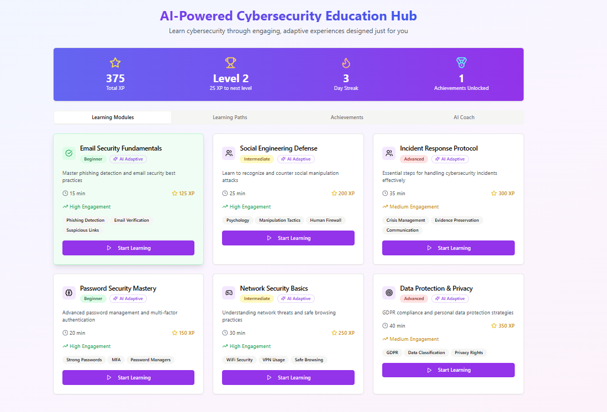
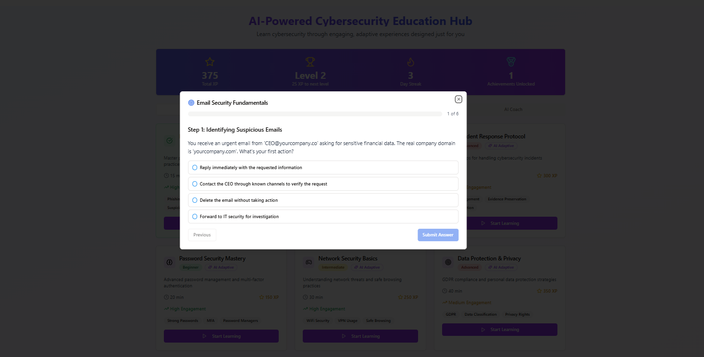
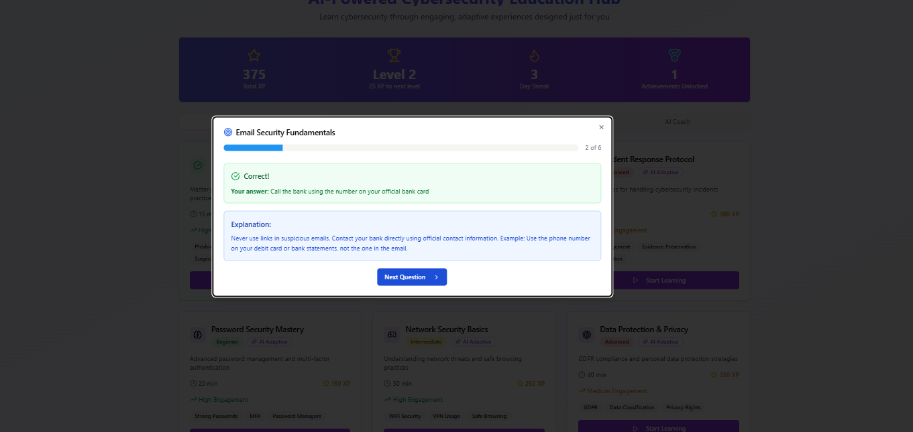
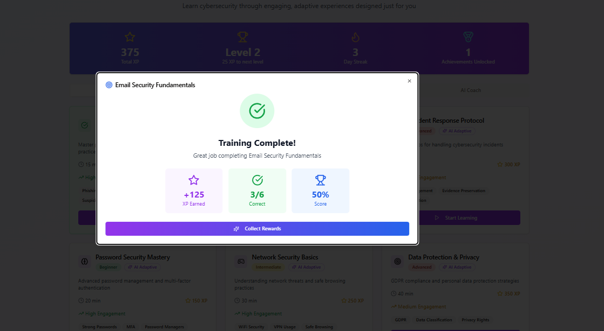
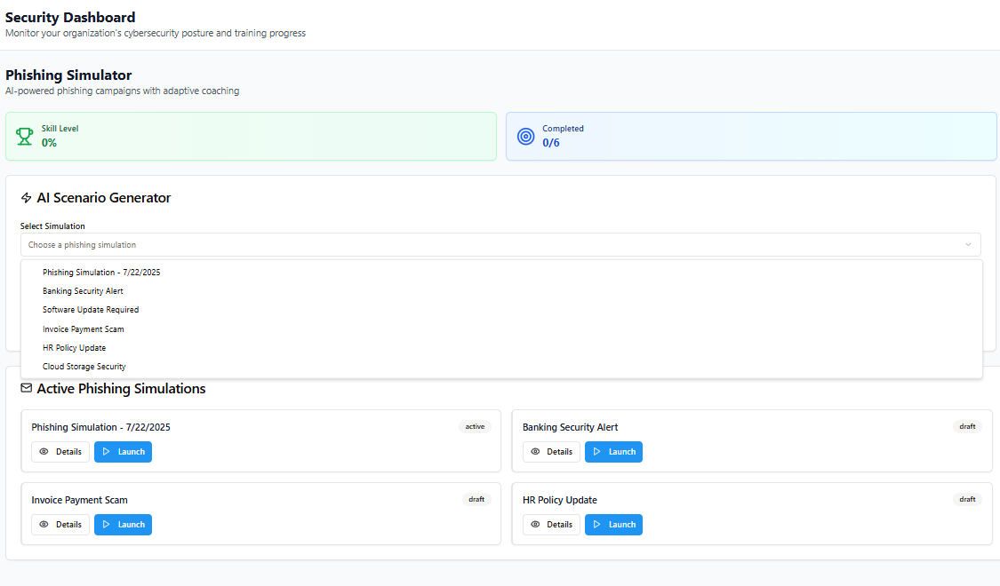
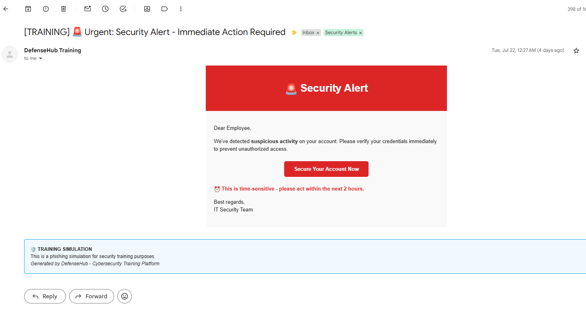
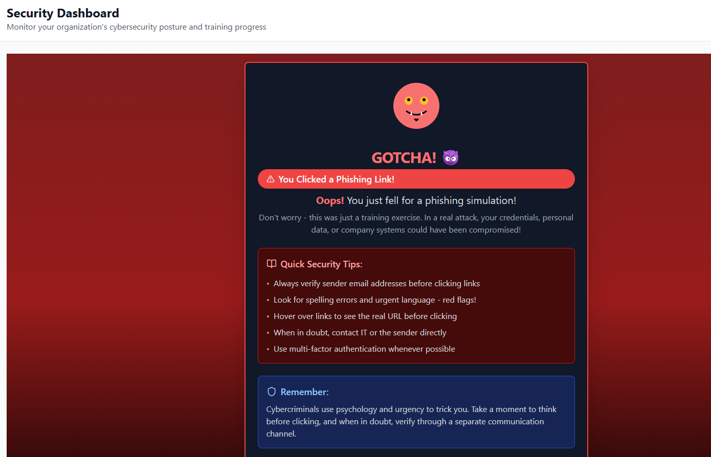

# DefenseHub: AI-Powered Cybersecurity Education Platform

[](https://sentinel-security-zerocalm.replit.app/reports)
[](LICENSE)
[](https://nodejs.org/)
[](https://reactjs.org/)

## 📋 Overview

DefenseHub is an innovative AI-powered cybersecurity education platform designed exclusively for employee learning and training. The platform focuses purely on educational experiences through interactive training modules, realistic phishing simulations, and gamified learning - with no security operations or threat monitoring components.

Live Demo: https://sentinel-security-zerocalm.replit.app/reports

### 🎯 Key Features

- **Pure Educational Focus** - 100% dedicated to learning with no security operations
- **AI-Powered Education Hub** - Adaptive learning with personalized coaching
- **Interactive Training Modules** - 6 comprehensive cybersecurity topics with real scenarios
- **Phishing Simulation Engine** - Safe training environment with immediate educational feedback
- **Gamified Learning System** - XP points, levels, and achievement tracking
- **Real-time Learning Analytics** - Live metrics showing active learners, completions, and progress
- **Educational Email Integration** - Automated training campaigns with instant learning moments

## 🖼️ Platform Screenshots

### AI-Powered Education Hub

*Main dashboard showing 6 cybersecurity learning modules with difficulty levels, XP rewards, and progress tracking. Each module includes interactive scenarios tailored to real-world threats.*

### Interactive Training Experience

*Step-by-step training with realistic cybersecurity scenarios. Users work through authentic situations like suspicious emails, with multiple choice responses that mirror real decision-making.*

### Instant Feedback System

*Immediate feedback after each answer with detailed explanations and real-world examples. The system shows correct/incorrect responses and provides educational context to reinforce learning.*

### Gamified Completion Rewards

*Celebration screen showing earned XP, completion score, and achievement unlocks. The gamification system motivates continued learning through visible progress and rewards.*

### Phishing Campaign Management

*Admin interface for creating and managing phishing simulation campaigns. Includes pre-built scenarios like banking alerts, software updates, and invoice scams with department targeting.*

### Realistic Phishing Emails

*Example of a realistic phishing email sent by the platform. Includes security alert styling with urgent call-to-action buttons, designed to test user awareness in a safe training environment.*

### Educational "Gotcha" Screen

*Educational screen shown when users click phishing links during training. Provides immediate learning with security tips and explanations, turning mistakes into teachable moments.*

## 🏗️ Technical Architecture

### Frontend
- **React 18** with TypeScript
- **Tailwind CSS** for responsive design
- **Radix UI** components for accessibility
- **TanStack Query** for data management
- **Wouter** for client-side routing

### Backend
- **Node.js** with Express.js
- **PostgreSQL** database with Drizzle ORM
- **WebSocket** support for real-time features
- **Nodemailer** for email functionality

### AI Integration
- **OpenAI GPT-4** for adaptive scenario generation
- **Dynamic difficulty scaling** based on user performance
- **Personalized coaching feedback** system

### Security & Compliance
- **Session-based authentication**
- **Role-based access control**
- **Audit logging** for all user actions
- **GDPR/SOC 2 compliance** tracking

## 🚀 Setup Instructions

### Prerequisites
- Node.js 18+ 
- PostgreSQL database
- Gmail account for email functionality
- OpenAI API key

### Gmail Setup for Email Integration

1. **Enable 2-Factor Authentication**
   - Go to [Google Account Security](https://myaccount.google.com/security)
   - Enable 2-Step Verification

2. **Generate App Password**
   - In Google Account settings, go to Security
   - Under "2-Step Verification", click "App passwords"
   - Select "Mail" and generate a password
   - Save this 16-character password

3. **Configure Environment Variables**
   ```bash
   SMTP_HOST=smtp.gmail.com
   SMTP_PORT=587
   SMTP_SECURE=false
   SMTP_USER=your-email@gmail.com
   SMTP_PASSWORD=your-16-character-app-password
   ```

### Installation

1. **Clone the repository**
   ```bash
   git clone https://github.com/yourusername/defensehub.git
   cd defensehub
   ```

2. **Install dependencies**
   ```bash
   npm install
   ```

3. **Setup environment variables**
   ```bash
   cp .env.example .env
   # Edit .env with your configuration
   ```

4. **Setup database**
   ```bash
   npm run db:push
   ```

5. **Start development server**
   ```bash
   npm run dev
   ```

## 📊 Learning Modules

### 1. Email Security Fundamentals (Beginner)
- Phishing detection techniques
- Email verification processes
- Suspicious link identification
- **6 interactive scenarios** - 125 XP

### 2. Social Engineering Defense (Intermediate)
- Psychology-based attack recognition
- Human firewall tactics
- Manipulation technique awareness
- **7 interactive scenarios** - 200 XP

### 3. Incident Response Protocol (Advanced)
- Crisis management procedures
- Evidence preservation
- Communication protocols
- **10 interactive scenarios** - 300 XP

### 4. Password Security Mastery (Beginner)
- Strong password creation
- Multi-factor authentication
- Password manager usage
- **5 interactive scenarios** - 150 XP

### 5. Network Security Basics (Intermediate)
- Wi-Fi security practices
- VPN usage guidelines
- Safe browsing habits
- **8 interactive scenarios** - 250 XP

### 6. Data Protection & Privacy (Advanced)
- GDPR compliance understanding
- Data classification systems
- Privacy rights awareness
- **12 interactive scenarios** - 350 XP

## 🎮 Gamification Features

- **XP System**: Earn points for completing modules and correct answers
- **Level Progression**: Unlock new content and achievements
- **Achievement Badges**: Visual recognition for milestones
- **Progress Tracking**: Real-time analytics and completion metrics
- **Streak Counters**: Encourage consistent learning habits

## 📧 Email Campaign Features

- **Department Targeting**: Send campaigns to specific teams
- **Realistic Templates**: Banking alerts, software updates, invoice scams
- **Immediate Feedback**: Educational "gotcha" screens for clicks
- **Progress Tracking**: Monitor user responses and learning
- **Custom Scenarios**: AI-generated content for variety

## 🛡️ Security Features

- **Safe Training Environment**: All phishing simulations are contained
- **Audit Logging**: Complete tracking of user interactions
- **Role-Based Access**: Admin, security admin, and user permissions
- **Data Protection**: Secure handling of training data and metrics

## 🌐 Deployment

The application is deployed at: **[DEPLOYMENT_URL_HERE]**

### Deploy to Production
1. Build the application: `npm run build`
2. Configure production environment variables
3. Deploy to your preferred hosting platform
4. Update the deployment URL in this README

## 📈 Educational Analytics & Reporting

- **Active Learning Metrics**: Real-time view of current learners and daily completions
- **Training Hours Tracking**: Weekly learning time and engagement monitoring  
- **Performance Analytics**: Average scores and learning effectiveness measurement
- **Phishing Awareness Growth**: Educational click rates and improvement tracking
- **Department Learning Metrics**: Compare training progress across teams
- **Educational Trend Analysis**: Identify learning patterns and knowledge gaps

## 🤝 Contributing

1. Fork the repository
2. Create a feature branch: `git checkout -b feature/amazing-feature`
3. Commit your changes: `git commit -m 'Add amazing feature'`
4. Push to the branch: `git push origin feature/amazing-feature`
5. Open a Pull Request

## 📝 License

This project is licensed under the MIT License - see the [LICENSE](LICENSE) file for details.

## 🙋‍♂️ Contact

**Project Creator**: [Your Name]
**Email**: [your-email@example.com]
**LinkedIn**: [Your LinkedIn Profile]
**Portfolio**: [Your Portfolio Website]

---

*Built with ❤️ for cybersecurity education and awareness*
